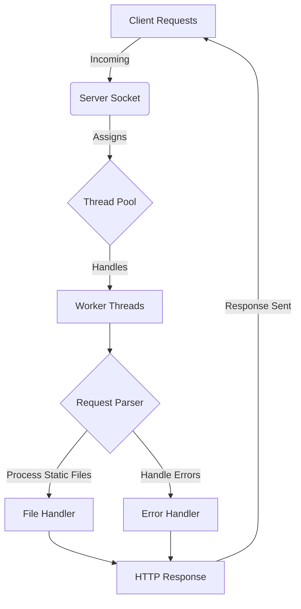

# Multithreaded Web Server


[](https://github.com/AlphaDecodeX/MultithreadedWebServer/pulls)

A high-performance **Multithreaded Web Server** implemented in Java. This server efficiently handles concurrent client requests using a **thread pool** mechanism, ensuring scalability and optimal resource utilization.

## 🌟 Features

- **Multithreading Support**: Uses **POSIX threads (pthreads)** for concurrent client handling.
- **Thread Pooling**: Implements a thread pool for better resource management and efficiency.
- **Static File Hosting**: Serves HTML, CSS, JavaScript, and images.
- **Logging**: Logs incoming requests for debugging and analysis.
- **Robust Performance**: Handles high workloads with minimal overhead.

## 🛠️ Technical Analysis

During development, a systematic comparison was performed between:
1. **Single-threaded approach** - inefficient under high traffic.
2. **Multi-threaded approach** - improved concurrency but led to resource exhaustion under heavy load.
3. **Thread-pool approach** - optimal, balancing performance, resource usage, and scalability.

Extensive testing under high workloads demonstrated the robustness of the thread-pool architecture, ensuring minimal overhead and efficient resource utilization.

## 📊 Architecture Diagram


## 📦 Installation & Compilation

### Linux/macOS:
```bash
# Clone the repository
git clone https://github.com/AlphaDecodeX/MultithreadedWebServer.git
cd MultithreadedWebServer

# Compile the server
g++ -pthread -o server server.cpp
```

### Windows (MinGW):
```bash
g++ -o server.exe server.cpp -lws2_32
```

## 🚀 Usage

### Running the Server
```bash
./server <PORT>
```
Example:
```bash
./server 8080
```

### Connecting to the Server
- Open a web browser and visit:
  ```
  http://localhost:8080
  ```
- Or use `curl`:
  ```bash
  curl http://localhost:8080
  ```


## 🔥 Performance & Scalability
- Uses **thread pooling** for managing connections efficiently.
- Handles high workloads with **minimal CPU & memory overhead**.
- Ensures **low latency** response times under stress tests.

## 🔮 Future Enhancements
- Implement **HTTP/1.1 Keep-Alive** for better performance.
- Add **support for dynamic content processing** (CGI or FastCGI).
- Implement **SSL/TLS encryption** for secure connections.
- Improve **detailed request logging & analytics**.

## 🤝 Contributing
Contributions are welcome! Feel free to **fork**, **improve**, and submit **pull requests**.

## 📜 License
This project is licensed under the **MIT License**.
